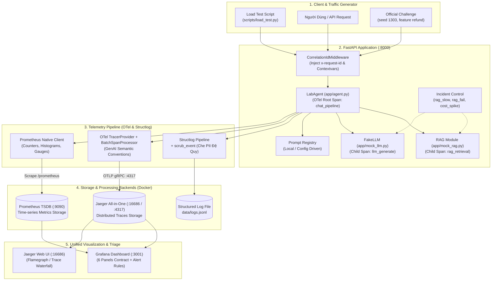
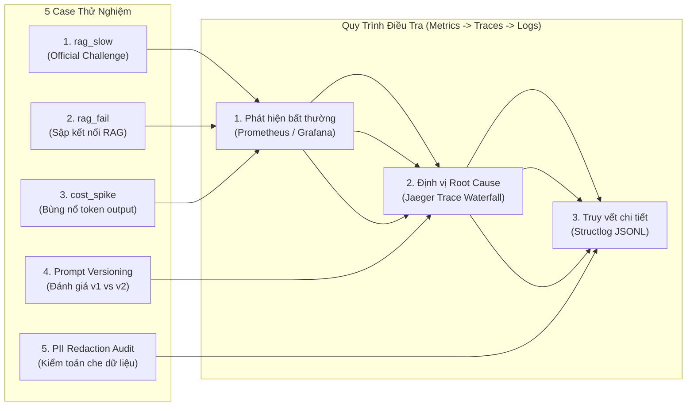

# Kiến Trúc Hệ Thống Observability Thuần Cloud-Native (OTel + Prometheus + Jaeger + Grafana)

Tài liệu này mô tả chi tiết kiến trúc hệ thống **Observability Chuẩn CNCF (Cloud Native Computing Foundation)** sau khi chuyển giao toàn bộ vai trò quan sát từ **Langfuse** sang bộ ba công cụ **OpenTelemetry (OTel) + Prometheus + Jaeger All-in-One + Grafana**.

---

## 1. Phân Tích: "Jaeger và Bộ Khung Mới Có Đảm Nhiệm Hoàn Toàn Vai Trò Của Langfuse Không?"

### 💡 Câu trả lời chính xác:
**Không phải một mình Jaeger đơn lẻ, mà là sự phối hợp của bộ ba `[OpenTelemetry + Jaeger + Prometheus/Grafana]` để thay thế trọn vẹn 100% vai trò của Langfuse.**

| Trách nhiệm của Langfuse | Cách Bộ Khung Mới (OTel + Jaeger + Prometheus + Grafana) Đảm Nhiệm |
|---|---|
| **1. Distributed Tracing & Flamegraph** | **Jaeger All-in-One** đảm nhiệm trực tiếp: Thể hiện cây Span phân cấp `chat_pipeline` $\rightarrow$ `rag_retrieval` $\rightarrow$ `llm_generate` với thời gian thực thi chính xác từng mili-giây. |
| **2. Theo dõi Token & Chi phí LLM** | **OpenTelemetry GenAI Semantic Conventions**: Gắn trực tiếp các attribute `gen_ai.usage.input_tokens`, `gen_ai.usage.output_tokens`, `gen_ai.usage.cost_usd` vào Span của Jaeger; đồng thời xuất sang **Prometheus Counters** (`ai_tokens_total`, `ai_cost_usd_total`) để vẽ đồ thị theo dõi trên **Grafana**. |
| **3. Prompt Versioning & Metadata** | **Config/Registry-driven**: Prompt được quản lý qua code/config (`app/prompt_management.py`), thông tin phiên bản (`prompt.name`, `prompt.version`, `prompt.label`) được gán trực tiếp vào OTel Span attributes trên **Jaeger**. |
| **4. Heuristic Quality Evaluation** | Điểm số chất lượng được ghi thành attribute `llm.quality_score` trên Span **Jaeger** và xuất ra **Prometheus Gauge** `ai_quality_score` hiển thị trên Panel 6 của **Grafana**. |
| **5. Cảnh báo Vi phạm SLO (Alerting)** | **Grafana Alerting + Prometheus**: Thiết lập Rule giám sát trực tiếp trên PromQL (P95 latency, Error rate, Token spike). |

---

## 2. Sơ Đồ Kiến Trúc Hệ Thống Mới (Pure Cloud-Native Observability)



---

## 3. Chi Tiết Cấu Trúc Span Chuẩn OTel GenAI Trên Jaeger

Khi một request `/chat` được thực thi, OpenTelemetry SDK sẽ tạo ra cấu trúc cây Span phân cấp như sau:

```text
[Trace: chat_pipeline] (Root Span) ───────────────────────────► Latency: 2,654ms
 │   Attributes:
 │   ├── correlation_id = "8f3b2a1c-..."
 │   ├── user_id_hash   = "a1b2c3d4..."
 │   ├── feature        = "refund"
 │   ├── llm.quality_score = 0.80
 │   └── llm.cost_usd   = 0.00245
 │
 ├──► [Child Span 1: rag_retrieval] ──────────────────────────► Latency: 2,501ms (94.2%)
 │       Attributes:
 │       ├── feature   = "refund"
 │       ├── doc_count = 2
 │       └── query     = "Chính sách hoàn tiền..."
 │
 └──► [Child Span 2: llm_generate] ───────────────────────────► Latency: 153ms (5.8%)
         Attributes (GenAI Conventions):
         ├── gen_ai.system              = "anthropic"
         ├── gen_ai.request.model       = "claude-sonnet-4-5"
         ├── gen_ai.usage.input_tokens  = 84
         ├── gen_ai.usage.output_tokens = 142
         ├── prompt.name                = "day13-chat"
         ├── prompt.version             = "1"
         └── prompt.label               = "production"
```

---

## 4. Ma Trận Case Thử Nghiệm & Điều Tra Sự Cố Với Khung Mới

Bộ ba **Prometheus + Jaeger + Grafana + Logs** tạo thành chu trình khép kín để xử lý toàn bộ 5 case thử nghiệm:



### 🔍 1. Case `rag_slow` (Challenge Chính Thức — Latency Spike)
* **Kích hoạt**: `POST /incidents/rag_slow/enable`
* **Prometheus & Grafana (Panel 1)**: Đường P95 Latency tăng vọt từ `~150ms` lên `~2.650ms`.
* **Jaeger UI (`http://localhost:16686`)**: Tìm trace của `/chat`. Mở Flamegraph: thấy ngay span `rag_retrieval` màu đỏ/dài bất thường chiếm `2.501ms`, trong khi `llm_generate` chỉ `150ms`. Kết luận điểm nghẽn nằm ở khâu truy vấn dữ liệu RAG.
* **Logs (`data/logs.jsonl`)**: Log `response_sent` có `latency_ms=2654, feature="refund"`.

---

### 🔍 2. Case `rag_fail` (RAG Service Outage — Error Rate 100%)
* **Kích hoạt**: `POST /incidents/rag_fail/enable`
* **Prometheus & Grafana (Panel 3)**: Đồ thị `Error Rate %` nhảy lên `100%`, Grafana kích hoạt Alert `HighErrorRate`.
* **Jaeger UI**: Span `rag_retrieval` đánh dấu cờ lỗi `error=true` kèm theo exception `RuntimeError: RAG service unavailable`.
* **Logs**: Xuất hiện log `request_failed` với `error_type="RuntimeError"` và đầy đủ `correlation_id`.

---

### 🔍 3. Case `cost_spike` (Bùng Nổ Token Chi Phí)
* **Kích hoạt**: `POST /incidents/cost_spike/enable`
* **Prometheus & Grafana (Panel 4 & 5)**: Đường `Output Tokens` và `Cost USD / Min` tăng vọt gấp 4 lần.
* **Jaeger UI**: Trên span `llm_generate`, kiểm tra attribute `gen_ai.usage.output_tokens` thấy tăng đột biến từ 120 lên $>500$ tokens/request.

---

### 🔍 4. Case Đánh Giá Prompt v1 vs v2 & Rollback
* **Cách thực hiện**: Thay đổi `LANGFUSE_PROMPT_LABEL=candidate` trong cấu hình môi trường để ứng dụng nạp prompt v2 (yêu cầu ngắn gọn 1-2 câu).
* **Jaeger UI**: So sánh 2 traces có `prompt.version = "1"` và `prompt.version = "2"`:
  * Trace v1: `gen_ai.usage.output_tokens = 150`, câu trả lời dài.
  * Trace v2: `gen_ai.usage.output_tokens = 65`, câu trả lời súc tích, tiết kiệm >50% token mà `llm.quality_score` vẫn đạt $0.80$.
* **Rollback**: Đổi lại cấu hình về `production` $\rightarrow$ hệ thống ngay lập tức quay về v1 an toàn.

---

### 🔍 5. Case Kiểm Toán & Che PII (Compliance Audit)
* **Cách thực hiện**: Gửi request chứa SĐT, Email, CCCD, Thẻ ngân hàng qua `/chat`.
* **Logs & Traces**: 
  * Jaeger Span attributes và Structlog `data/logs.jsonl` đều được che sạch thành `[REDACTED_PHONE]`, `[REDACTED_CARD]`.
  * `python scripts/validate_logs.py` đạt **100/100 điểm** (0 rò rỉ PII).

---

## 5. Hướng Dẫn Khởi Chạy Nhanh Toàn Bộ Hệ Thống

```powershell
# 1. Khởi động cụm Docker (Prometheus, Jaeger, Grafana)
docker compose -f docker-compose.otel.yml up -d

# 2. Khởi chạy FastAPI Server (Langfuse tắt, OTel bật mặc định)
.\.venv\Scripts\python.exe -m uvicorn app.main:app --reload --port 8000

# 3. Gửi tải sinh dữ liệu
.\.venv\Scripts\python.exe scripts\load_test.py --concurrency 5

# 4. Truy cập các giao diện trực quan hóa:
# 👉 Jaeger Tracing UI:  http://localhost:16686 (Service: 'day13-observability-lab')
# 👉 Grafana Dashboard:  http://localhost:3001  (User: admin / Pass: admin)
# 👉 Prometheus UI:      http://localhost:9090
```
